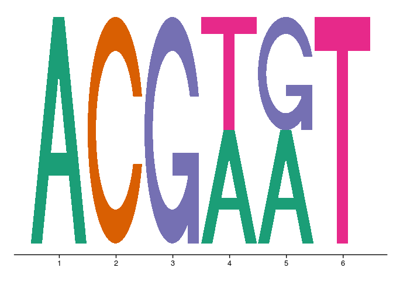
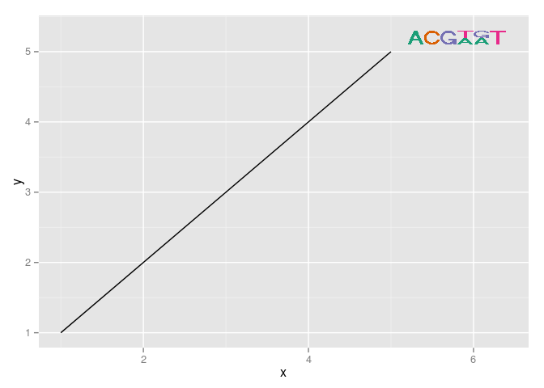

<!-- README.md is generated from README.Rmd. Please edit that file -->


ggmotif
=======

add DNA sequence motifs to ggplot

Inspired by, and letters based on, seqLogo Bioconductor package.

Plots DNA sequence motif in ggplot2 framework.

Install using `devtools::install_github` (Not on CRAN).

Either create a standalone plot, or add a sequence logo at a specific position with a specific size into a ggplot.

``` {.r}
library(ggmotif)
#> Loading required package: ggplot2
```

``` {.r}
ggmotif_plot("ACGWRT") 
```



Can also use position frequency matrix instead of character string:

``` {.r}
mat = Biostrings::consensusMatrix("ACGWRT")
mat
#>   [,1] [,2] [,3] [,4] [,5] [,6]
#> A    1    0    0    0    0    0
#> C    0    1    0    0    0    0
#> G    0    0    1    0    0    0
#> R    0    0    0    0    1    0
#> T    0    0    0    0    0    1
#> W    0    0    0    1    0    0

ggmotif_plot(mat) 
```


Or add a sequence logo at a specific position with a specific size into a ggplot.

``` {.r}
ggplot(data.frame(x = 1:5,y =1:5),aes(x=x,y=y)) + geom_line() + 
  ggmotif("ACGWRT", x.pos = 5.1, y.pos = 5.1, ht = 0.2, wt = 0.2) + 
  ggmotif_scale() 

```


